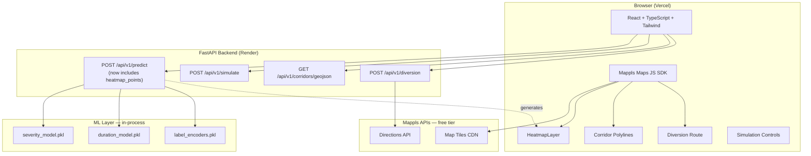
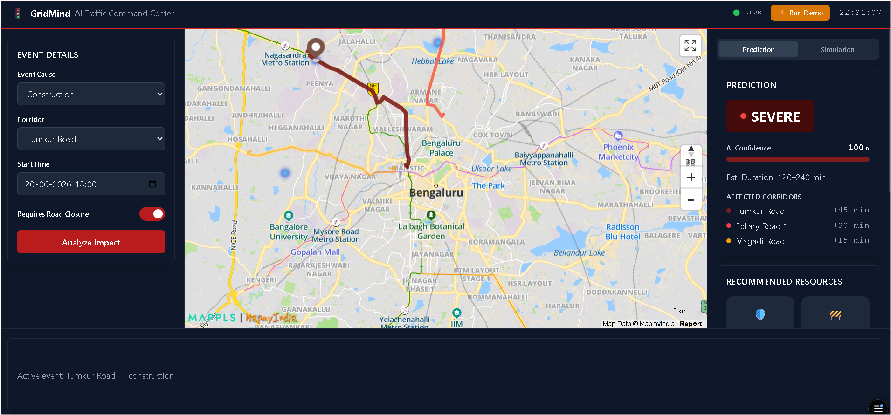
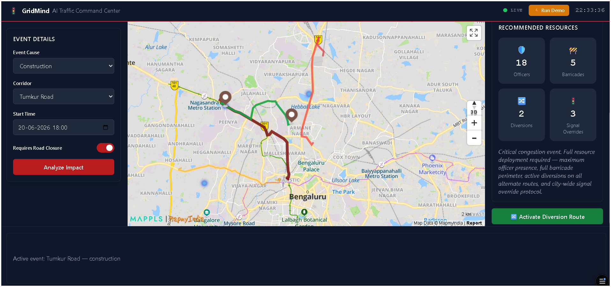
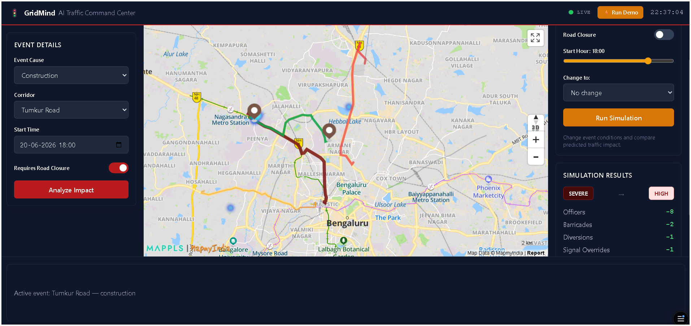

# GridMind — AI Traffic Command Center

**Gridlock Hackathon 2.0 — Round 2 (by Flipkart)**
**Problem Statement 2 — Event-Driven Congestion (Planned & Unplanned)**

> Political rallies, festivals, sports events, construction activity, and sudden gatherings create localized traffic breakdowns in Bengaluru. Today, their impact isn't quantified in advance, resource deployment is experience-driven, and there's no post-event learning loop. GridMind forecasts event-related traffic impact from historical + real-time inputs and recommends manpower, barricading, and diversion plans — before the disruption peaks, not after.

---

## Team

**Team Name:** Deadlock 2.0
**Team Size:** 3 members

| Name | Role | LinkedIn |
|---|---|---|
| Sejal Kshirsagar | ML Engineer | https://www.linkedin.com/in/sejalsksagar/ |
| Sakshi Nalawade | Backend Engineer | https://www.linkedin.com/in/sakshi-nalawade-6ab324192/ |
| Priya Sharma | Frontend Engineer | https://www.linkedin.com/in/priya-sharma-mitwpu/ |

---

## Links

| Resource | Link |
|---|---|
| **Repository** | https://github.com/sejalsksagar/gridmind |
| **Backend (Render — Swagger docs)** | https://gridmind-w534.onrender.com/docs |
| **Frontend (Vercel — Live App)** | https://gridmind-pink.vercel.app/ |
| **Kaggle — EDA Notebook** | https://www.kaggle.com/code/sejalkshirsagar/gridmind-eda |
| **Kaggle — Event Impact Prediction Pipeline** | https://www.kaggle.com/code/sejalkshirsagar/gridmind-event-impact-prediction-pipeline |
| **Kaggle — Demo Validation & Feature Importance** | https://www.kaggle.com/code/sejalkshirsagar/gridmind-demo-validation-feature-importance |
| **Demo Video** | https://youtu.be/x1hHTirVF-0 |

> ⚠️ Note: the backend runs on Render's free tier and cold-starts after inactivity. The first request after idle time can take 30–50 seconds — this is expected, not a bug. Visiting `/docs` once before judging warms it up.

---

## What We're Doing

GridMind is an AI Traffic Command Center for Bengaluru that takes a single traffic-disrupting event — a road closure for construction, an accident, a procession, a planned public gathering — and answers three questions instantly:

1. **How bad will this get?** (congestion severity class + how long it'll likely last)
2. **What else gets hit?** (which adjacent corridors absorb the spillover, and by how much delay)
3. **What do we send?** (how many officers, barricades, diversions, and signal overrides — with a stated rationale)

It also lets an operator **simulate "what if"** — e.g. "what if we lift the road closure two hours earlier?" — and see the predicted improvement in both severity and resource cost, before committing resources in the field.

---

## Why We're Doing It

Bengaluru's traffic control today depends on officer experience and word-of-mouth situational awareness. That works, but it doesn't scale, isn't consistent across shifts, and leaves no record for the next time the same corridor sees a similar event. The problem statement asks specifically: *how can historical and real-time data forecast event impact and recommend manpower, barricading, and diversion plans?*

Our answer: encode the operational judgment that experienced traffic controllers already use (road closure → higher severity, named-corridor events → spillover risk, certain event causes → longer disruptions) into a model trained on **8,173 real Bengaluru traffic event records**, so that judgment is available instantly, consistently, and auditable — to every officer, every time, not just the most experienced one on shift.

---

## Solution Details

### Core capability
- **Event Impact Prediction** — `POST /api/v1/predict` returns a congestion class (Low/Medium/High/Severe), a duration class + estimated time range, the list of corridors expected to be affected (with per-corridor delay estimates), and a resource recommendation block (officers, barricades, diversions, signal overrides) with a plain-language rationale.
- **Dynamic Heatmap** — the same `/predict` response now returns `heatmap_points`: the event location plus cascading-severity centroids of affected corridors, rendered directly on the map via Mappls' native heatmap layer.
- **Corridor Overlay** — `GET /api/v1/corridors/geojson` draws Bengaluru's major arterial corridors on the map, recolored by predicted severity after each prediction.
- **Simulation** — `POST /api/v1/simulate` runs a base event and an overridden version (e.g. closure lifted, time shifted, cause changed) side-by-side and returns a delta: how much the resource footprint and severity change.
- **Diversion Routing** — `POST /api/v1/diversion` calls the Mappls Directions API server-side and returns a real, drivable route for the frontend to draw as a dashed diversion path.

### Why MapmyIndia (Mappls)
We chose Mappls over Leaflet/OpenStreetMap or Google Maps because: (1) its tiles already carry accurate Bengaluru corridor names and road geometry matching our dataset out of the box, (2) it ships a native `HeatmapLayer` we'd otherwise have to build by hand, and (3) its Directions API gives us a real routable diversion path on the free tier — Indian smart-city deployments (BBMP/BTP) already standardize on Mappls, so this is also the realistic production choice, not just a hackathon convenience.

### ML approach 
No ground-truth congestion measurements exist in the dataset, so we derived a **composite severity label** from operational signals already present (road closure flag, incident priority, event cause category, whether it's on a named corridor, and resolved duration), then trained a **LightGBM multiclass classifier** for severity and a second one for duration. Full label construction, feature engineering, and honest discussion of the model's macro F1 (0.96 severity / 0.60 duration) is in the technical document and the Kaggle notebooks linked above.

---

## Architecture Diagram




---

## Screenshots

**1. Prediction view — Severe congestion forecast for a Tumkur Road construction closure, with affected corridors and live confidence score:**



**2. Resource recommendation panel — officer/barricade/diversion/signal-override deployment with rationale, plus the diversion route activation control:**



**3. Simulation panel — comparing base vs. modified event conditions:**




---

## Tech Stack

| Layer | Technology |
|---|---|
| Frontend | React + TypeScript + Tailwind CSS, deployed on Vercel |
| Maps | Mappls (MapmyIndia) Maps JS SDK — basemap, heatmap layer, polylines |
| Backend | FastAPI (Python 3.11), deployed on Render |
| ML | LightGBM (severity + duration multiclass classifiers), scikit-learn, pandas |
| External API | Mappls Directions API (server-side, for diversion routing) |

---

## Repository Structure (high level)

```
gridmind/
├── backend/
│   ├── app/
│   │   ├── main.py
│   │   ├── routers/       (predict, simulate, corridors, diversion)
│   │   ├── services/      (prediction, recommendation, diversion)
│   │   ├── models/        (schemas.py + ml/*.pkl)
│   │   └── core/          (config.py, dependencies.py)
│   ├── requirements.txt
│   └── render.yaml
└── frontend/
    ├── src/
    │   ├── components/    (EventForm, PredictionPanel, SimulationControls, map/*)
    │   ├── hooks/          (usePrediction, useSimulation, useMapmyIndia)
    │   ├── api/client.ts
    │   └── types/index.ts
    ├── index.html
    └── vercel.json
```

---

Built for Gridlock Hackathon 2.0 (Flipkart) 2026